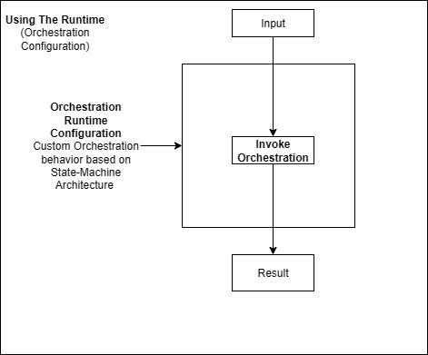
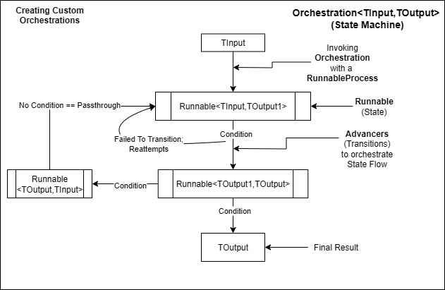

# Orchestration

Orchestration Runtime provides powerful state machine-based workflows for complex agent coordination and process management.

## Overview

Orchestration Runtime is built on state machine architecture where:
- **Orchestration** acts as a state machine with strongly typed `TInput` and `TOutput` values
- **Runnable** represents a state within the state machine with typed input/output validation
- **Advancer** handles state transitions with conditional logic for advancing to the next runnable
- **Conversion Methods** facilitate transitions between incompatible input/output types



## Core Concepts

### Orchestration State Machine

The orchestration acts as the overall state machine controller:

```csharp
using LlmTornado.Agents.ChatRuntime.Orchestration;

// Define input and output types for the orchestration
public class MyOrchestration : Orchestration<string, ReportData>
{
    public MyOrchestration()
    {
        // Set up initial runnable and transitions
        InitialRunnable = new PlanningRunnable();
    }
}
```

### Runnable States

Runnables represent individual states in your workflow:

```csharp
public class PlanningRunnable : OrchestrationRunnable<string, WebSearchPlan>
{
    public override async Task<WebSearchPlan> Invoke(string input)
    {
        // Create and configure agent for this state
        TornadoAgent planningAgent = new TornadoAgent(
            Program.Connect(),
            ChatModel.OpenAi.Gpt41.V41Mini,
            instructions: "You are a research planner. Create search plans for research topics.",
            outputSchema: typeof(WebSearchPlan)
        );

        // Execute the agent and return structured output
        var result = await TornadoRunner.RunAsync(planningAgent, input);
        return result.Messages.Last().Content.ParseJson<WebSearchPlan>();
    }
}
```

## Complete Orchestration Example

### Research Report Orchestration

Here's a complete example of a research report generation workflow:

```csharp
// Data Models
public struct WebSearchPlan
{
    [Description("List of search queries to execute")]
    public List<WebSearchItem> SearchItems { get; set; }
    
    [Description("Research topic")]
    public string Topic { get; set; }
}

public struct WebSearchItem
{
    [Description("Search query")]
    public string Query { get; set; }
    
    [Description("Expected information type")]
    public string InformationType { get; set; }
}

public struct ReportData
{
    [Description("Report title")]
    public string Title { get; set; }
    
    [Description("Report content in markdown")]
    public string Content { get; set; }
    
    [Description("Executive summary")]
    public string Summary { get; set; }
}

// Planning State
public class PlanningState : OrchestrationRunnable<string, WebSearchPlan>
{
    public override async Task<WebSearchPlan> Invoke(string input)
    {
        TornadoAgent planningAgent = new TornadoAgent(
            Program.Connect(),
            ChatModel.OpenAi.Gpt41.V41Mini,
            instructions: """
                You are a research planner. Given a research topic, create a comprehensive
                search plan with multiple specific queries to gather information.
                """,
            outputSchema: typeof(WebSearchPlan)
        );

        var result = await TornadoRunner.RunAsync(planningAgent, 
            $"Create a research plan for: {input}");
        
        return result.Messages.Last().Content.ParseJson<WebSearchPlan>();
    }
}

// Research State
public class ResearchState : OrchestrationRunnable<WebSearchPlan, string>
{
    public override async Task<string> Invoke(WebSearchPlan input)
    {
        // Tool for web search
        [Description("Search the web for information")]
        string WebSearch(string query) => $"Search results for: {query}";

        TornadoAgent researchAgent = new TornadoAgent(
            Program.Connect(),
            ChatModel.OpenAi.Gpt41.V41Mini,
            instructions: """
                You are a research assistant. Execute the search plan and gather
                comprehensive information on all the search items.
                """,
            tools: [WebSearch]
        );

        var searchPlan = JsonConvert.SerializeObject(input);
        var result = await TornadoRunner.RunAsync(researchAgent, 
            $"Execute this search plan and gather information: {searchPlan}");
        
        return result.Messages.Last().Content;
    }
}

// Reporting State
public class ReportingState : OrchestrationRunnable<string, ReportData>
{
    public override async Task<ReportData> Invoke(string input)
    {
        TornadoAgent reportAgent = new TornadoAgent(
            Program.Connect(),
            ChatModel.OpenAi.Gpt41.V41Mini,
            instructions: """
                You are a professional report writer. Create comprehensive reports
                based on research data with proper structure and formatting.
                """,
            outputSchema: typeof(ReportData)
        );

        var result = await TornadoRunner.RunAsync(reportAgent, 
            $"Create a professional report based on this research: {input}");
        
        return result.Messages.Last().Content.ParseJson<ReportData>();
    }
}

// Complete Orchestration
public class ResearchOrchestration : Orchestration<string, ReportData>
{
    public ResearchOrchestration()
    {
        // Set up the state machine
        var planningState = new PlanningState();
        var researchState = new ResearchState();
        var reportingState = new ReportingState() {AllowDeadEnd = true};

        planningState.AddAdvancer(researchState);
        researchState.AddAdvancer(reportingState);

        InitialRunnable = planningState;
        RunnableWithResult = reportingState;
    }
}

// Usage
var orchestration = new ResearchOrchestration();
var result = await orchestration.RunAsync("The future of artificial intelligence in healthcare");
Console.WriteLine($"Title: {result.Title}");
Console.WriteLine($"Summary: {result.Summary}");
Console.WriteLine($"Content: {result.Content}");
```

## Orchestration Invoke Process

The orchestration invoke process follows this detailed flow:



1. **Input Validation** - Validate and prepare input
2. **State Selection** - Determine initial or next state
3. **State Execution** - Execute the runnable state
4. **Output Processing** - Process state output
5. **Transition Check** - Check if advancement is needed
6. **State Transition** - Move to next state if applicable
7. **Completion Check** - Determine if workflow is complete

### Dynamic State Creation

Create states dynamically based on runtime conditions:

```csharp
public class DynamicAdvancer : OrchestrationAdvancer<ConfigData, ProcessInput>
{
    public override OrchestrationRunnableBase GetNextRunnable(ConfigData output)
    {
        // Create state based on configuration
        return output.WorkflowType switch
        {
            "coding" => CreateCodingWorkflow(output),
            "analysis" => CreateAnalysisWorkflow(output),
            "reporting" => CreateReportingWorkflow(output),
            _ => new DefaultWorkflowState()
        };
    }

    private OrchestrationRunnableBase CreateCodingWorkflow(ConfigData config)
    {
        return new CodingState
        {
            Language = config.Language,
            Framework = config.Framework,
            Requirements = config.Requirements
        };
    }

    private OrchestrationRunnableBase CreateAnalysisWorkflow(ConfigData config)
    {
        return new AnalysisState
        {
            AnalysisType = config.AnalysisType,
            DataSources = config.DataSources,
            OutputFormat = config.OutputFormat
        };
    }
}
```

## Event Handling and Monitoring

Monitor orchestration execution:

```csharp
ValueTask HandleOrchestrationEvents(OrchestrationEvent orchestrationEvent)
{
    switch (orchestrationEvent.EventType)
    {
        case OrchestrationEventType.StateStarted:
            Console.WriteLine($"🚀 State started: {orchestrationEvent.StateName}");
            break;

        case OrchestrationEventType.StateCompleted:
            Console.WriteLine($"✅ State completed: {orchestrationEvent.StateName}");
            break;

        case OrchestrationEventType.StateTransition:
            Console.WriteLine($"🔄 Transition: {orchestrationEvent.FromState} → {orchestrationEvent.ToState}");
            break;

        case OrchestrationEventType.OrchestrationCompleted:
            Console.WriteLine($"🎉 Orchestration completed successfully");
            break;

        case OrchestrationEventType.OrchestrationFailed:
            Console.WriteLine($"❌ Orchestration failed: {orchestrationEvent.ErrorMessage}");
            break;
    }
    return ValueTask.CompletedTask;
}

// Set up event handling
orchestration.OnOrchestrationEvent = HandleOrchestrationEvents;
```

## Integration with Chat Runtime

Use orchestration within Chat Runtime:

```csharp
using LlmTornado.Agents.ChatRuntime.RuntimeConfigurations;

// Create orchestration runtime configuration
public class OrchestrationRuntimeConfiguration : IRuntimeConfiguration
{
    public CancellationTokenSource cts { get; set; }
    
    private readonly Orchestration<string, ReportData> _orchestration;
    
    public OrchestrationRuntimeConfiguration(Orchestration<string, ReportData> orchestration)
    {
        _orchestration = orchestration;
    }
    
    public async Task<ChatMessage> InvokeAsync(
        ChatMessage input, 
        Func<ChatRuntimeEvents, ValueTask>? onRuntimeEvent = null)
    {
        // Execute orchestration
        var result = await _orchestration.RunAsync(input.Content);
        
        // Return as chat message
        return new ChatMessage(ChatMessageRoles.Assistant, result.Content);
    }
}

// Usage with Chat Runtime
var orchestration = new ResearchOrchestration();
var runtimeConfig = new OrchestrationRuntimeConfiguration(orchestration);
var runtime = new ChatRuntime(runtimeConfig);

var result = await runtime.InvokeAsync(
    new ChatMessage(ChatMessageRoles.User, "Research AI in healthcare")
);
```

## Best Practices

### State Design

1. **Single Responsibility**: Each state should have one clear purpose
2. **Typed Interfaces**: Use strongly typed input/output for validation
3. **Idempotency**: Design states to be safely re-runnable
4. **Error Boundaries**: Handle errors within states when possible

### Orchestration Architecture

1. **State Granularity**: Balance between too many small states and too few large ones
2. **Data Flow**: Design clear data transformations between states
3. **Parallel Opportunities**: Identify operations that can run in parallel
4. **Recovery Points**: Plan for rollback and recovery scenarios

### Performance Optimization

1. **Resource Pooling**: Reuse agents and connections where possible
2. **Caching**: Cache expensive operations and intermediate results
3. **Streaming**: Use streaming for long-running operations
4. **Monitoring**: Track performance metrics for optimization

## Common Orchestration Patterns

### Linear Pipeline
Planning → Research → Analysis → Reporting

### Branching Workflow
Analysis → (Data Processing | Text Processing | Image Processing) → Aggregation

### Fan-Out/Fan-In
Input → (Parallel Tasks) → Aggregation → Output

### Iterative Refinement
Process → Validate → (Refine if needed) → Complete

## Troubleshooting

### Common Issues

**State Transition Failures**
```
Error: Unable to advance to next state
```
Solution: Check advancer conditions and type conversions.

**Type Conversion Errors**
```
Error: Cannot convert output type to input type
```
Solution: Implement proper conversion methods in advancers.

**Infinite Loops**
```
Error: Orchestration never completes
```
Solution: Ensure advancement conditions eventually become false.


## Next Steps

- Learn about [State Machines](state-machines.md) for advanced control flow
- Explore [Concurrent Runtime](concurrent-runtime.md) for parallel execution
- Check [Examples](examples/) for complete orchestration implementations
- Review [Best Practices](best-practices.md) for production deployments